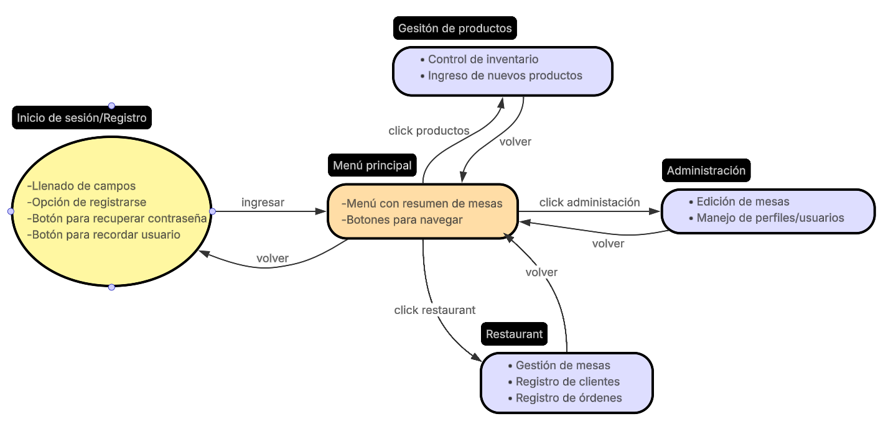

# Presentado por:
- Álvaro Carrasco
- Cristian Soto
- Ignacio López
- Benjamín Palamara

# Sistema de Gestión de Restaurante – *DiauloFood*

## Índice
1. [Resumen del Proyecto](#resumen-del-proyecto)  
2. [Requerimientos](#requerimientos)  
3. [Roles del Sistema](#roles-del-sistema)  
4. [Requerimientos Funcionales por Rol](#requerimientos-funcionales-por-rol)  
5. [Requerimientos No Funcionales](#requerimientos-no-funcionales)  
6. [Arquitectura de la Información](#arquitectura-de-la-información)  
7. [Diseño de prototipos](#diseño-de-prototipos)  
8. [Navegación y Experiencia de Usuario (1.4)](#navegación-y-experiencia-de-usuario-14)  
9. [Librerías y Tecnologías](#librerías-y-tecnologías)  

---

## Resumen del Proyecto
*DiauloFood* es una aplicación web desarrollada en **Ionic + Angular** que permite gestionar un restaurante de manera integral.  
El sistema contempla:
- Administración de usuarios por rol (administrador y mesero).  
- Gestión de productos de la carta.  
- Visualización en tiempo real del estado de las mesas.  
- Asignación y control de pedidos vinculados a cada una.  

La propuesta busca optimizar la experiencia tanto del personal como de los clientes, asegurando rapidez, usabilidad y consistencia visual.

---

## Requerimientos

### Roles del Sistema
- **Administrador**: Control total sobre el sistema, gestión de productos, usuarios y mesas.  
- **Mesero**: Puede gestionar pedidos, asignar mesas y cambiar su estado.  

---

## Requerimientos Funcionales por Rol

### Rol – Administrador
- **RF-1**: Registrar usuarios (mesero, administrador).  
- **RF-2**: Inicio de sesión por rol.  
- **RF-3**: Gestión de sesión (mostrar nombre y rol, cerrar sesión).  
- **RF-4**: Crear mesas con número y ubicación.  
- **RF-5**: Editar mesas existentes.  
- **RF-6**: Eliminar mesas con confirmación.  
- **RF-12**: Mostrar lista de productos con id, nombre, costo, margen de ganancia y precio final.  
- **RF-14**: CRUD de productos (crear, editar, eliminar, habilitar/deshabilitar).  
- **RF-15**: CRUD de usuarios con asignación de roles.  

### Rol – Mesero
- **RF-2**: Inicio de sesión y acceso a interfaz de mesero.  
- **RF-7**: Visualizar estado de mesas (libre, ocupada, reservada).  
- **RF-8**: Cambiar estado de mesa.  
- **RF-9**: Asignar pedidos a una mesa con productos, cantidad y precio.  
- **RF-10**: Ver detalle de consumo por mesa (subtotal y total).  
- **RF-11**: Buscar y filtrar carta.  
- **RF-13**: Ver detalle de producto.  

### Validaciones y feedback
- **RF-16**: Validaciones en formularios (errores bajo campos inválidos, no enviar incompleto).  
- **RF-17**: Mensajes de éxito/error consistentes (ej. pedido agregado, mesa cerrada).  

---

## Requerimientos No Funcionales
- **RNF-1: Fluidez de interacción** → navegación sin retrasos visibles.  
- **RNF-2: Manejo eficiente de pedidos** → actualización < 1 segundo.  
- **RNF-3: Consistencia visual** → uso uniforme de componentes Ionic.  
- **RNF-4: Seguridad de datos** → contraseñas cifradas, sin logs sensibles en consola.  
- **RNF-5: Validación en cliente** → formularios con validación frontend.  
- **RNF-6: Manejo de errores** → mensajes claros y reutilizables (toast, alert, modal).  
- **RNF-7: Rendimiento de carga** → pantalla inicial en < 3 segundos.  

---

## Arquitectura de la Información
La navegación principal incluye:  
- **Home**: vista general y acceso rápido.  
- **Restaurante**: visualización y gestión de mesas.  
- **Productos**: administración de la carta.  
- **Administrar**: gestión de usuarios y roles.  
- **Auth**: registro, login y recuperación de credenciales.  

### Diagrama de navegación

## Diseño de prototipos
Se realizaron prototipos en **Figma**, contemplando al menos 7 pantallas (web y móvil).  

👉 [https://www.figma.com/design/CuK58ZDfp13Tno1BijVZMr/Mockups-Web-Parcial-1?node-id=0-1&t=xrWhksod8hu37pp9-1](#) 
## Navegación y Experiencia de Usuario

### Principios de UX
- **Consistencia**: todos los botones de mesas mantienen el mismo estilo, variando solo el color según el estado.  
- **Visibilidad de estado**: colores y numeración clara en cada mesa.  
- **Feedback inmediato**: al seleccionar una mesa, se muestra su detalle o acción disponible.  
- **Simplicidad**: interfaz centrada en lo esencial (mesas, productos, administración).  
- **Control del usuario**: posibilidad de volver siempre al inicio mediante el menú/tab superior.  

### Patrones de UX
- **Panel central**: Home como centro de navegación.  
- **Color coding**: uso de colores para distinguir el estado de las mesas.  
- **Pestañas de navegación**: permiten moverse rápido entre secciones.  
- **Botón flotante de ajustes**: acceso a configuración sin saturar la interfaz.  

---

## Librerías y Tecnologías
- **Ionic Framework** (v7+)  
- **Angular** (v15+)  
- **TypeScript**  

##IMPORTANTE
- **Al momento de querer abrir el proyecto en un local host propio recordar hacer uso de la carpeta Proyecto-Web-DiauloFood-main**

